# Malta-Guinness-Sales-Analysis
This project analyzes sales performance for Malta Guinness products using SQL, focusing on key metrics such as total revenue, product performance, regional sales distribution, customer segments, and sales trends over time. The goal is to uncover actionable insights that can support better business decisions, improve marketing strategies, and optimize product and sales channel performance.

## Introduction
In this project, I analyzed a Malta Guinness sales dataset from Kaggle using SQL to evaluate sales performance, product demand, and customer behavior. The goal was to uncover key sales trends, identify revenue drivers, and generate insights to support better decision-making in the beverage industry.

---

## Data cleaning & preparation process
-	Outsourced dataset from Kaggle
-	Imported CSV dataset into Microsoft SQL Server
-	Checked for null values and duplicates 
-	Remove null values and duplicates 
-	Created Fact and Dimension table to reduce redundancy 
-	Built relationships between table and ER diagram 
-	Created queries to solve business problems

---

## Business Objectives 
1.	Total Revenue generated
2.	Sales trend over time (Monthly & Quarterly Revenue)
3.	Top selling products (Revenue & Volume)
4.	Top 5 Regions by revenue 
5.	Customer type performance
6.	Preferred payment method 
7.	Revenue by Channel (Online VS Offline)

--- 

## Analysis
1. Total Revenue 

   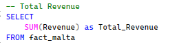  | 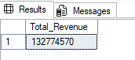

The Total revenue (#132,774,570) generated provides a high level view of business performance which spans from 2023 - 2025.

2. Sales trend Monthly Revenue

   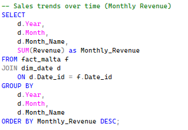 | 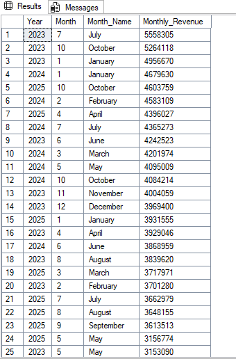

   
July, January, October 2023 shows peak monthly sales performance in revenue and how revenue fluctuates over time. 
This insight shows July 2023 stands out as the highest-performing month, suggesting possible seasonal demand or impact during that time period.

2b. Sales trend Quarterly Revenue

   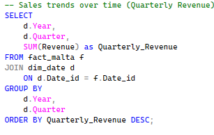 | 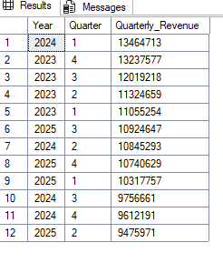 

Q1 2024 is the strongest performing quarter in sales performance while Q2 2025 shows how sales depreciates over time.

3. Top selling products (Revenue)

   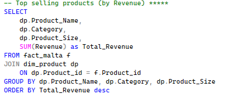   |   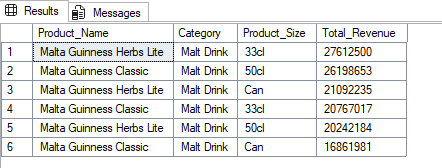

This shows Malta Guinness Herbs Lite 33cl generates the highest revenue (27.6M) indicating strong customer preference and positioning it as a key product to prioritize in marketing.

3b. Top selling products (Volume)

  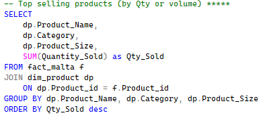 | 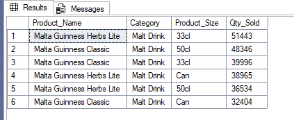

Malta Guinness Herbs Lite 33cl also dominates in units volume (51,443 units) which shows the product is in high demand and also high value.

4. Top 5 Regions by revenue

   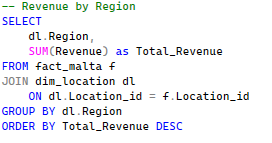 | 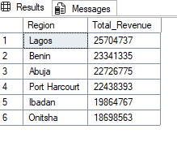

Lagos generates the highest revenue, suggesting a strong market presence and higher demand in the region. This reveals an opportunity to further invest in distribution and marketing in Lagos while developing strategies to improve performance in underperforming regions.

5.	Customer type performance

    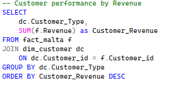 | 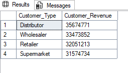

Distributors are the leading customers generating the most revenue (35.6M) while supermarkets supermarkets contribute the least revenue (31.5M), indicating a potential gap in channel performance that may require targeted strategies to improve sales.

6.	Preferred payment method

  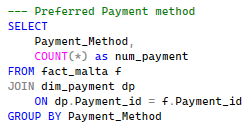 | 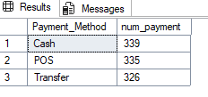

Customers majorly pay through the traditional way which is cash payment. The dominance of cash payments highlights a reliance on traditional methods, suggesting an opportunity to encourage digital payments such as transfers and POS for better transaction tracking and transparency.

7.	Revenue by Channel (Online VS Offline)

    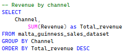 | 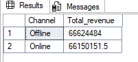

Both channels perform almost equally, with a slight advantage for offline sales, indicating balanced customer purchasing behavior pattern across channels.

----

## Modeling

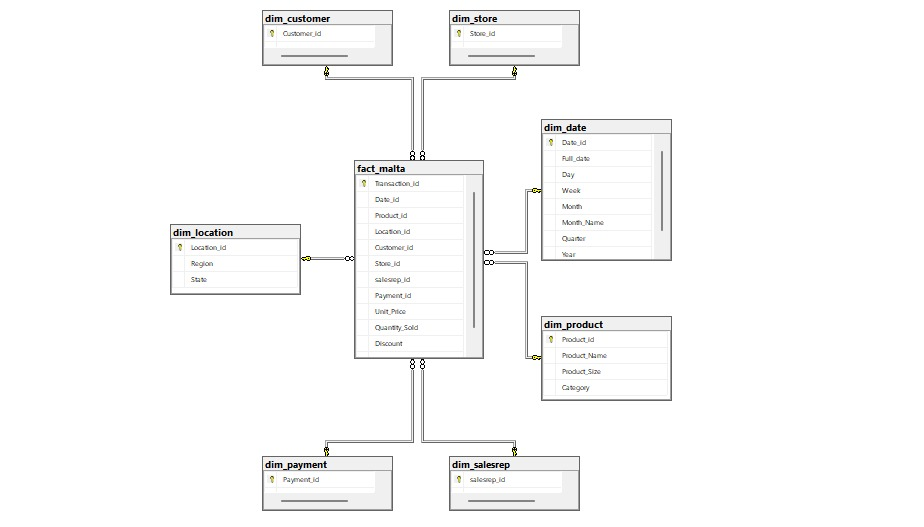

The model is a star schema, there are 7 dimension tables and 1 fact table.
Each dimension table has a one-to-many relationship with the fact table, where the fact table stores transactional data and the dimension tables provide descriptive context.

---

## Key Insights & Recommendations

| Key Insights | Recommendations |
|--------------|-----------------|
| Revenue is driven by a few high-performing products | Focus marketing on top-performing products |
| Lagos is the strongest market | Expand strategies in underperforming regions |
| Distributors contribute the most revenue | Encourage digital payment methods |
| Offline channels dominate sales | Strengthen underperforming customer segments |
| Cash remains the primary payment method | Promote digital payment adoption |
